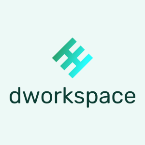

# dWorkspace

<p align="center" width="100%"></p>
<p align="center" width="100%">Standard structure for Dev directories!</p>


### How to run

```bash
1. cd <somehere>; git clone https://github.com/bmalbusca/dworkspace.git
2. cp dworkspace/workspaces.sh <your-target-dir>
3. cd <your-target-dir>; bash ./workspaces.sh

```
> The script also have some usage tips. Remember, this is an interactive script that allows you to add as many external project folders or tutorials as you want.

### The result
```bash

workspaces
├── documents           > Used to save Markdown journals
│   ├── notes           -----> Save articles, drafts and other notes
│   └── publish         -----> Add your Markdown notes for future blog publishing
├── <external-work-1>
├── <external-work-2>
├── <external-work-3>
└── internal            > Personal code
    ├── lab             ----> Save all your learning stuffs and tutorials
    │   ├── foo         
    │   ├── <framework-1>
    │   ├── <framework-2>
    │   └── <language-1>
    └── projects        ----> Personal (big) projects
        ├── current
        ├── late-2019
        └── late-2020

```
